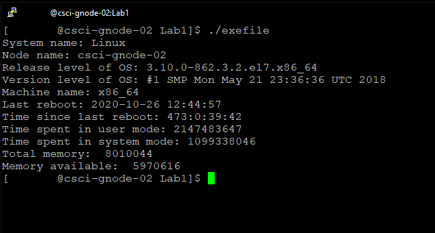

# Operating Systems Lab 1: System Calls & Proc Filesystem

### Desc

A simple Linux application which uses system calls and the proc filesystem to retrieve device and hardware information and display it to the user.

### How to build and run

After downloading the .cpp file and the makefile, open a terminal in the folder and run the "make" command to build the binaries.
Enter "./exefile" in the terminal to run the program. To clean up the binaries, run the commmand "make clean".

### Usage

After building the executables, you can run the server by entering the command: ./server1 \<portnumber\>.
Similarly, you can run the client with: ./client1 \<ipaddress\> \<portnumber\>

The port number can be any port number, but preferably in the range of 1024-65,536
The IP address is just the address of the server. If the server is on the same machine as the client, you can provide 127.0.0.1 for the IP address

The server will just simply remain open and write any incoming messages to the console window. You can enter in strings up to 128 bytes on the client side. Entering "STOP" will close the client side application.

### Source Files

#### source.cpp
- source.cpp contains the entirety of the program logic.

### Completion status 

Successfully compiles and runs on Linux (g++)

### Example screenshot 
 <!-- this just displays the screenshot for github, https://github.com/spartan2375/OS-Lab1 -->